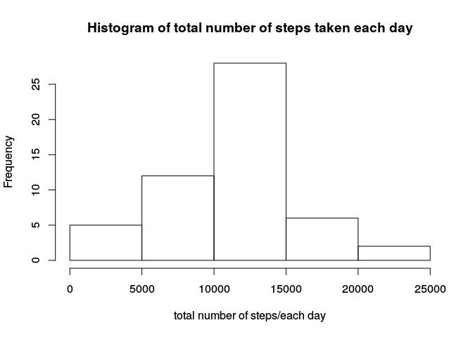
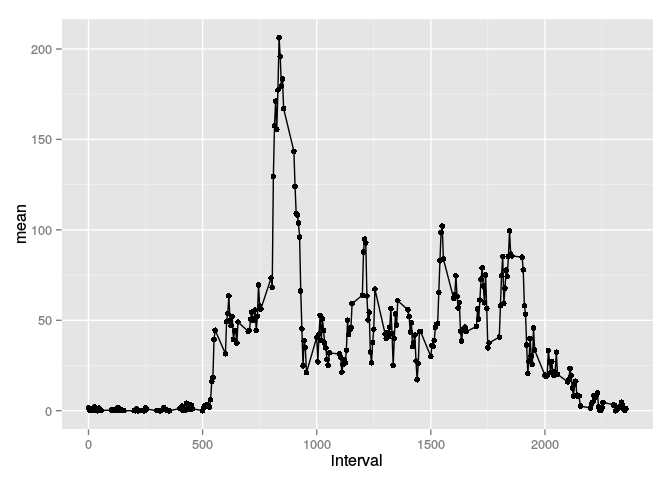
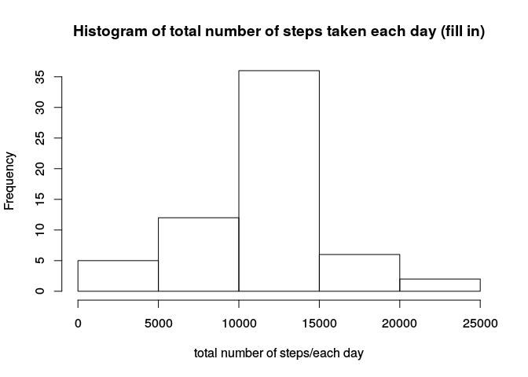
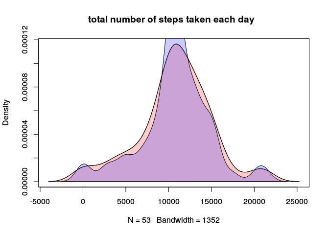
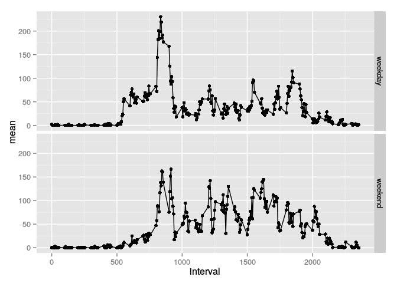

# Reproducible Research: Peer Assessment 1

This is a report for the first peer assessment for Reproducible Research (repdata-034). For detalles of the assessment, please read the file: readme.md

<span style="color:orange;">**I’m not a native speaker, sorry for my bad english**</span>

*load all packages*


```r
library(plyr)
library(dplyr)
```

```
## 
## Attaching package: 'dplyr'
## 
## The following objects are masked from 'package:plyr':
## 
##     arrange, count, desc, failwith, id, mutate, rename, summarise,
##     summarize
## 
## The following objects are masked from 'package:stats':
## 
##     filter, lag
## 
## The following objects are masked from 'package:base':
## 
##     intersect, setdiff, setequal, union
```

```r
library(ggplot2)
library(lubridate)
```

```
## 
## Attaching package: 'lubridate'
## 
## The following object is masked from 'package:plyr':
## 
##     here
```

## Loading and preprocessing the data
you need to read the file "cvs" with:


```r
data<-read.csv("activity.csv")
str(data)
```

```
## 'data.frame':	17568 obs. of  3 variables:
##  $ steps   : int  NA NA NA NA NA NA NA NA NA NA ...
##  $ date    : Factor w/ 61 levels "2012-10-01","2012-10-02",..: 1 1 1 1 1 1 1 1 1 1 ...
##  $ interval: int  0 5 10 15 20 25 30 35 40 45 ...
```

The date is a factor (these not good). You need convert date, I used a lubridate package.


```r
data$date<-ymd(data$date)
str(data)
```

```
## 'data.frame':	17568 obs. of  3 variables:
##  $ steps   : int  NA NA NA NA NA NA NA NA NA NA ...
##  $ date    : POSIXct, format: "2012-10-01" "2012-10-01" ...
##  $ interval: int  0 5 10 15 20 25 30 35 40 45 ...
```

Looks better :)

## What is mean total number of steps taken per day?

* *Calculate the total number of steps taken per day*

I used for this part a package dplyr 


```r
stepsxday<-data %>% na.omit() %>% group_by(date) %>% summarize(total = sum(steps))
```

see the first part of the table


```r
head(stepsxday)
```

```
## Source: local data frame [6 x 2]
## 
##         date total
## 1 2012-10-02   126
## 2 2012-10-03 11352
## 3 2012-10-04 12116
## 4 2012-10-05 13294
## 5 2012-10-06 15420
## 6 2012-10-07 11015
```

* *Make a histogram of the total number of steps taken each day*


```r
hist(stepsxday$total, 
     main = "Histogram of total number of steps taken each day", 
     xlab ="total number of steps/each day")
```

 

* *Calculate and report the mean and median of the total number of steps taken per day*

The mean is calculated with mean() and the median with median()
    

```r
x <- mean(stepsxday$total, na.rm = TRUE)
y <- median(stepsxday$total, na.rm=TRUE) 
```

The number for mean is 1.0766189\times 10^{4} and the median 10765


## What is the average daily activity pattern?

* *Make a time series plot (i.e. type = "l") of the 5-minute interval (x-axis) and the average number of steps taken, averaged across all days (y-axis)*

For do that, you need a data of the steps for interval. The code for this plot and data (with package ggplot2) is:


```r
stepsxinterval<-data %>% na.omit() %>% group_by(interval) %>% 
    summarise(mean=mean(steps, na.rm = TRUE), sd = sd(steps, na.rm=TRUE))
ggplot(stepsxinterval, aes(x = interval, y = mean))+geom_point()+geom_line()
```

 

* *Which 5-minute interval, on average across all the days in the dataset, contains the maximum number of steps?*


The answer is **835** and the strategy is easy, you need subset the data (stepsxinterval) for the max of mean, like code:


```r
x<-subset(stepsxinterval, mean == max(mean))
x$interval
```

## Imputing missing values
* *Calculate and report the total number of missing values in the dataset (i.e. the total number of rows with NAs)*

The code for that is with is.na:


```r
n_na <- sum(is.na(data))
```

And the number of missing values is **2304** 

* *Devise a strategy for filling in all of the missing values in the dataset. The strategy does not need to be sophisticated. For example, you could use the mean/median for that day, or the mean for that 5-minute interval, etc.*

In this time, I used a easy way for filling in of the missing values. The values missing is the same value of the average number of steps taken, averaged across all days for intervals.


* *Create a new dataset that is equal to the original dataset but with the missing data filled in.*

For create a new dataset, I used loops structures: for and if.


```r
data2<-data
for (j in 1:nrow(data2)){
    if (is.na(data2[j,1]==TRUE)){
        n_interval <- data2[j,3]
        data2[j,1]<-stepsxinterval$mean[stepsxinterval$interval ==n_interval]
    }
}
head(data2)
```

```
##       steps       date interval
## 1 1.7169811 2012-10-01        0
## 2 0.3396226 2012-10-01        5
## 3 0.1320755 2012-10-01       10
## 4 0.1509434 2012-10-01       15
## 5 0.0754717 2012-10-01       20
## 6 2.0943396 2012-10-01       25
```

* *Make a histogram of the total number of steps taken each day and Calculate and report the mean and median total number of steps taken per day. Do these values differ from the estimates from the first part of the assignment? What is the impact of imputing missing data on the estimates of the total daily number of steps?*

For the histogram, I used the same code


```r
stepsxday2<-data2 %>% na.omit() %>% group_by(date) %>% summarize(total = sum(steps))
hist(stepsxday2$total, 
     main = "Histogram of total number of steps taken each day (fill in)", 
     xlab ="total number of steps/each day")
```

 

I put two histogram together for appreciated the different:


```r
dens1<-density(stepsxday$total, na.rm = TRUE)
dens2<-density(stepsxday2$total)
original<-rgb(1,0,0,0.2)
fill_in<-rgb(0,0,1,0.2)
plot(dens1, main = 'total number of steps taken each day  ', panel.first = grid)
polygon(dens1, density = -1, col = original)
polygon(dens2, density = -1, col = fill_in)
```

 

This histogram is more centralizied more values landing on the median. And the code for mean and median:


```r
x2 <- mean(stepsxday2$total, na.rm = TRUE)
y2 <- median(stepsxday2$total, na.rm=TRUE) 
```

The number for mean is 1.0766189\times 10^{4} and the median 1.0766189\times 10^{4}


## Are there differences in activity patterns between weekdays and weekends?

* *Create a new factor variable in the dataset with two levels – “weekday” and “weekend” indicating whether a given date is a weekday or weekend day.*

For this, I used a weekdays() and the library plyr. When used a weekdays, the column has a class "charachter". look the code:


```r
data2$day <- weekdays(as.Date(data2$date))
data2$day<-revalue(data2$day, c("Monday"="weekday","Friday"="weekday","Thursday"="weekday", "Tuesday"="weekday","Wednesday"="weekday","Saturday"="weekend","Sunday"="weekend"))
head(data2)
```

```
##       steps       date interval     day
## 1 1.7169811 2012-10-01        0 weekday
## 2 0.3396226 2012-10-01        5 weekday
## 3 0.1320755 2012-10-01       10 weekday
## 4 0.1509434 2012-10-01       15 weekday
## 5 0.0754717 2012-10-01       20 weekday
## 6 2.0943396 2012-10-01       25 weekday
```

* *Make a panel plot containing a time series plot (i.e. type = "l") of the 5-minute interval (x-axis) and the average number of steps taken, averaged across all weekday days or weekend days (y-axis). See the README file in the GitHub repository to see an example of what this plot should look like using simulated data.*

First I prepared the data2 of group (interval and day). After I ploting.


```r
stepsxinterval<-data2 %>% group_by(interval,day) %>% summarise(mean=mean(steps, na.rm = TRUE), sd = sd(steps, na.rm=TRUE))
ggplot(stepsxinterval, aes(x = interval, y = mean))+geom_point()+geom_line()+facet_grid(day~.)
```

 
